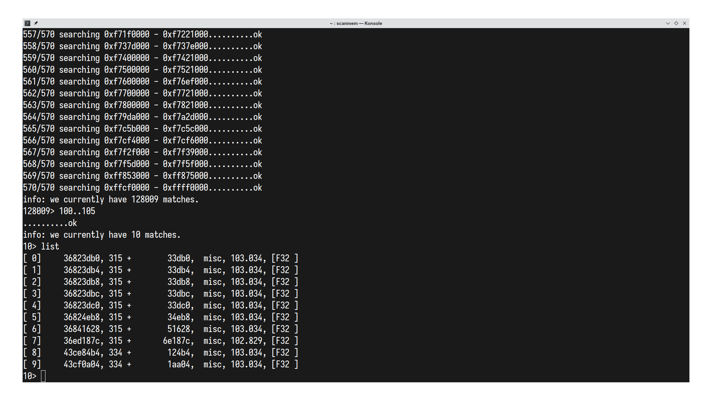
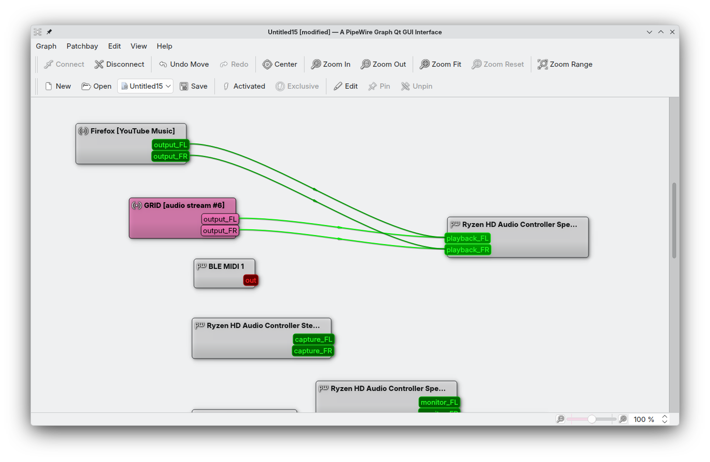
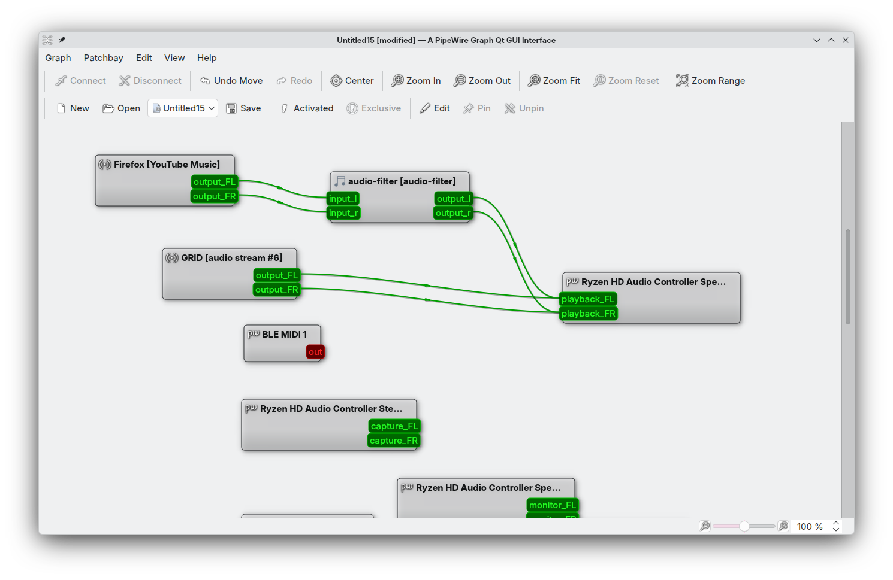

# Introduction
I like racing games, but a lot of modern games do not run well on my laptop, so I naturally like older racing games and my top ones are Need For Speed: Most Wanted (2005), Burnout Paradise and Race Driver: GRID. Now this obviously does not deter me from trying out modern games (and later uninstalling them due to the unplayable FPS). I recently tried out this game called [NIGHT RUNNERS PROLOGUE](https://store.steampowered.com/app/2707900/NIGHTRUNNERS_PROLOGUE/).And its a fun game, but it had one amazing feature which was, the music's volume was based on the driving speed. _This is my experiment to get the same feature in Race Driver: GRID running through WINE in linux and hopefully establish a methodology to do the same for other racing games on other platforms_.

# Plan
My initial plan is to scan the memory of the game and see which bytes change similar to the speed as I drive and ensure those are the bytes I need and then track those bytes and scale my linux master volume based on the driving speed. I've not done anything like this before for not just games, but any program, i.e., attach to a process, scan the memory, etc. So this will be completely new to me.
1. I need to learn a bit about processes in linux.
2. Understand how to read the memory of attached processes.
3. Create or use a memory scanner.
4. Experiment in game and find out the necessary bytes.
5. Streamline the process and figure out a way to seamlessly integrate it with a normal program.
6. Understand about how linux (or my distribution audio stack at least) processes audio.
7. Control it using an external program.
8. Combine the results and enjoy.

Is this the best/most efficient way? I do not know.

# Execution
### Processes in linux and memory
- All processes have a unique process id which helps us access and track it.
- Information about processes can be found under `/proc/[pid]` and can be accesses files.
- Now, what we need is memory info about a process which can be found under `/proc/[pid]/mem` and relevant memory regions can be found under `/proc/[pid]/maps`.
- Initially the extremely naive approach I took was scanning `/proc/[pid]/mem` using C, which was very useless. And then I did some research and found [scanmem](https://github.com/scanmem/scanmem).
- Good [resource about process memory](https://www.baeldung.com/linux/get-memory-address-value).
- Find `pid` of a process using either `pidof GAME.exe` or `ps aux | grep GAME.exe` for more details

### Memory scanner (scanmem)
- I had some trouble understanding this tool at first and after some tinkering around and reading the help dialogue, it made a lot more sense. Some advice: **take the time to fully understand the help message, the manpage and any other resources you can find** before even attempting to do any sort of memory operations.
- Some great resources on `scanmem` are:
  - `man mem`
  - [mankier's page on scanmem](https://www.mankier.com/1/scanmem)
  - [using scanmem for hacking games on linux](https://archive.0x00sec.org/t/game-hacking-on-linux-scanmem-basics/2458)
- I'm not going to talk about using `scanmem` itself, but I am going to highlight a very stupid mistake I made.
- Launch `scanmem` using `scanmem -p pid`
- Now since I am dealing with a racing game here, and I wanna narrow down the speed of the car which keeps changing per frame, and I spent a bunch of time trying to narrow down the value with `+ some speed` or `- some speed` or `> some speed` or `< speed`, etc. you get the point.
- Now what I did not realize was ranges and **enabling floating point values**. I should have realized sooner that speeds are stored as floating point values of course, and after some time wasted, enabled `option scan_data_type float` and then based on the in-game HUD's speedometer, searched through a range of `start..end`, eg. If my speed was `163 mph`, the search would be `160..165`. Do this a few times and it'll get you down to a few matches.
- Specifically for Race Driver: GRID, I got 10-11 matches for the speed value and I dont know which one was valid, because all of them were getting updated with the same value for every scan, hence I just went with the first value located at `36823db0`.


### Reading from the desired memory address in C
```c
#include <fcntl.h>
#include <stdint.h>
#include <stdio.h>
#include <stdlib.h>
#include <unistd.h>

int main() {
  size_t sz = 4;
  int proc_fd = open("/proc/pid/mem", O_RDONLY);
  uint32_t start_addr = 0x36823db0;
 // 1024 change sz and buffer size based on the amount of bytes you need to read, here we only need 4, as we're reading a 32-bit float.
  uint8_t buffer[1024];
  lseek(proc_fd, start_addr, SEEK_SET);
  ssize_t bytes_read = read(proc_fd, buffer, sz);
  printf("%f\n", *(float *) buffer); // this should give you the correct floating point value similar to what you had in scanmem. Thats it, now we have our speed.
}

```

### Audio processing
- Processing audio in linux is probably the hardest thing I've attempted to do till now simply because of non-standard and fragmented APIs and audio stacks. This was insanely difficult also because of the very lack luster documentation for linux audio APIs. I current use pipewire and googling is basically useless for anything related to audio programming in linux for some reason. But practically a whole day was wasted trying to figure out which library to use and how to even get shit working. It was just a horrible experience, _and this very well could just be a major skill issue on my part, but this was my experience_. So anyways after a lot of failed experiments, I settled on using `libpipewire`. This might be super unnecessary and complicated, but this was the only thing I could get working. Simpler option were to use `alsa` or `pulseaudio` but none of them worked. Also using something like `pactl` or `wpctl` by spawning a subprocess or fork is not even an option here, because of nature of the game and high speed audio updates.
- Anyways, then I thought it was something as simple as 
```
connect to pw -> get stream -> change volume
```

**But how mistaken I was!** The actual process I've followed is,

```
create a pipewire filter -> get input to filter -> get vehicle speed from game -> process the filter using signal processing based on speed -> copy to filter output

- create a thread to continuously read the vehicle speed
- create a thread to run the pipewire filter based on the speed.
```
I have a feeling that this could have some kind of hidden race conditions but I'm not sure. Now this process comes with some issues, but mainly: no connections are made automatically, which means I need to manually setup links for applications -> filter input and filter output -> audio device. Luckily there's `qpwgraph` which allows me to do this.

###### without audio filter


###### with audio filter


All the pipewire related code was based on this [example](https://docs.pipewire.org/tutorial7_8c-example.html) from the pipewire docs. So playing around for a long time with this file and figuring out what the heck is actually going on gave me more clarity and of course, reading the pipewire [docs](https://docs.pipewire.org/) itself was very ~~confusing~~ helpful! So far, all that happens is, the connected (using `qpwgraph`) application's audio stream's volume is mapped to the vehicle in Race Driver: GRID, yes thats it!

### Future
- I definitely wanna extend this to first make connections automatically.
- Have more audio effects than just volume control.
- Automate the process of finding the PID and such. 
- Maybe extend it even more in the future and make it more general. (Probably not)
